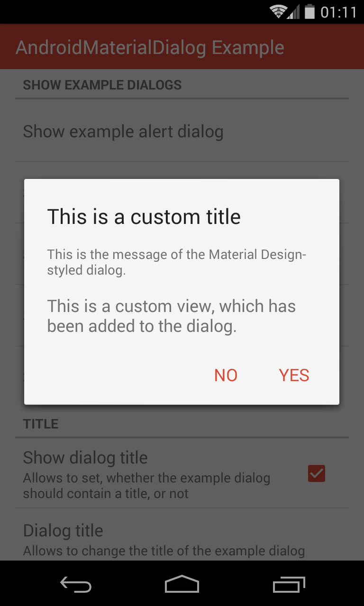

# AndroidMaterialDialog - README

[](https://android-arsenal.com/api?level=14) [](https://opensource.org/licenses/Apache-2.0) [](https://www.paypal.com/cgi-bin/webscr?cmd=_s-xclick&hosted_button_id=X75YSLEJV3DWE)

"AndroidMaterialDialog" is an Android-library, which provides builders for creating dialogs, which are designed according to Android 5's Material Design guidelines even on pre-Lollipop devices. The following screenshots show the appearances of dialogs, which have been created using the library.


The library provides the following main features:

- The builder `MaterialDialog.Builder` allows to create dialogs, which may contain a title, an icon, a message, up to three buttons and optional list items.
- By using the builder `ProgressDialog.Builder` it is possible to create dialogs, which show a circular progress bar.
- Dialogs, which are created using the builder `WizardDialog.Builder`, contain a `ViewPager` for switching between multiple fragments.
- The library comes with a light and dark theme. For both themes a fullscreen variant is available as well.
- All dialogs may contain a header, which consists of a background image or color and an optional icon.
- By offering various methods for changing the appearance of UI elements, the library's dialogs are highly customizable. It is even possible to replace a dialog's title, message, content or buttons with custom views. Also the size and position of dialogs can be modified.
- The library offers built-in support for easy use of animations. This corresponds to showing and hiding dialogs in an animated manner, as well as changing backgrounds and icons by using animations.

The project also includes an example application, which implements some example dialogs for demonstrating the use of the library.

## License Agreement

This project is distributed under the Apache License version 2.0. For further information about this license agreement's content please refer to its full version, which is available at http://www.apache.org/licenses/LICENSE-2.0.txt.

Prior to version 3.1.1 this library was distributed under the GNU Lesser General Public License version 3.0 (GLPLv3).

## Download

The latest release of this library can be downloaded as a zip archive from the download section of the project's Github page, which is available [here](https://github.com/michael-rapp/AndroidMaterialDialog/releases). Furthermore, the library's source code is available as a Git repository, which can be cloned using the URL https://github.com/michael-rapp/AndroidMaterialDialog.git.

Alternatively, the library can be added to your Android app as a Gradle dependency by adding the following to the respective module's `build.gradle` file:

```groovy
dependencies {
    compile 'com.github.michael-rapp:android-material-dialog:4.2.1'
}
```

Before version 2.0.0 this project was hosted on [Sourceforge](https://sourceforge.net/projects/androidmaterialdialog). These older versions used the legacy Eclipse ADT folder structure and are not available as Gradle artifacts.

## Examples

In the following a few examples, which illustrate the use of the library's most important features, are given. Moreover, this project contains the source code of an example app, which implements use cases of the library for demonstration purposes, as well as a more detailed documentation in the Wiki and auto-generated javadoc files. 

### Creating a typical alert dialog

The code below shows how to create and show an alert dialog by using the library's `MaterialDialog.Builder`. The dialog contains a title and message and can be closed by the user by either using a "OK" button or a "Cancel" button. The `this` parameter, which is passed to the builder's constructor in the example below, must be a `Context`, e.g. an `Activity`. The `null` parameters, which are passed to the `setPositiveButton`- and `setNegativeButton`-methods can be replaced by instances of the type `DialogInterface.OnClickListener` in order to execute some code when the user closes the dialog by clicking the corresponding button.

```java
MaterialDialog.Builder dialogBuilder = new MaterialDialog.Builder(this); 
dialogBuilder.setTitle(R.string.dialog_title); 
dialogBuilder.setMessage(R.string.dialog_message); 
dialogBuilder.setTitle(R.string.dialog_title); 
dialogBuilder.setPositiveButton(android.R.string.ok, null); 
dialogBuilder.setNegativeButton(android.R.string.cancel, null); 
MaterialDialog dialog = dialogBuilder.create();
dialog.show();
```

The appearance of the dialog, which is created by the given sample code, is shown below:


### Using custom views

In order to adjust the appearance of a `MaterialDialog`, it is possible to specify custom views for displaying its title, message, content and button bar. All of these custom views can be given as a layout resource or as a `View` instance. The following example illustrates, how such custom views can be set to a `MaterialDialog.Builder`, which has been instantiated as shown in the previous section.

```java
MaterialDialog.Builder builder = new MaterialDialog.Builder(context);
builder.setView(R.layout.custom_dialog_content);
builder.setCustomTitle(R.layout.custom_dialog_title);
builder.setCustomMessage(R.layout.custom_dialog_message);
builder.setCustomButtonBar(R.layout.custom_dialog_button_bar);
builder.setCustomHeader(R.layout.custom_dialog_header);
```

When using custom layouts, which contain views of the same type and being associated with the same id as the views in the original layout, the dialog's methods (e.g. the `setTitle`-method) can be used as before. To do so, the following views must be contained by the different types of layouts:

- If using a custom view for displaying the title, the view or one of its children must be an `EditText` with the id `android.R.id.title` to be able to show the title correctly. To display the icon, an `ImageView` with the id `android.R.id.icon` must be contained as well.
- To enable the dialog's message to be shown, an `EditText` with the id `android.R.id.message` must be available accordingly. 
- If using a custom view for displaying the dialog's buttons, the individual `Button` widgets are referenced via the ids `android.R.id.button1` (primary button), `android.R.id.button2` (secondary button) and `android.R.id.button2` (tertiary button). 
- When using a custom layout for displaying the dialog's header, it must contain an `ImageView` with the id `android.R.id.icon` to be able to show the header's icon.

An example, which uses custom views for displaying the title, message, content and buttons, is shown in the screenshot below.



### Creating a progress dialog

The following source code shows how a progress dialog, which displays a circular progress bar, can be created. Such as a regular `MaterialDialog`, such a dialog can contain a title, a message and up to three buttons. By using the `setProgressBarPosition`-method, the position of the dialog's progress bar can be specified. Possible values are `LEFT`, `TOP`, `RIGHT` and `BOTTOM`, each specifying the position in relation to the dialog's message.

```java
ProgressDialog.Builder dialogBuilder = new ProgressDialog.Builder(this); 
dialogBuilder.setTitle(R.string.dialog_title); 
dialogBuilder.setMessage(R.string.dialog_message); 
dialogBuilder.setPositiveButton(android.R.string.ok, null); 
dialogBuilder.setNegativeButton(android.R.string.cancel, null); 
dialogBuilder.setProgressBarPosition(ProgressBarPosition.LEFT) 
ProgressDialog dialog = dialogBuilder.create(); 
dialog.show();
```

The screenshot below shows the appearance of a `ProgressDialog`, which has been created using the given sample code:


### Creating a wizard dialog

A `WizardDialog` allows to show multiple fragments and provides a navigation for switching between them by either using tabs or buttons, which are located at the bottom of the dialog. The source code below shows how such a dialog can be created. The tabs, which indicate the currently selected fragment, are shown in the dialog's header if possible. This behavior can be customized by using the `setTabPosition`-method. If the value `USE_HEADER` is passed to the method, the tabs are shown in the header, if the dialog does neither contain a title, nor a message. The default value `PREFER_HEADER` causes the tabs to be shown in the header regardless of any title or message are shown. And the value `NO_HEADER` prevents the tabs from being shown in the header at all. By default, the tabs, which are shown by the dialog are not clickable and the currently shown fragment can only be changed using swipe gestures or the button bar. If the tabs should be clickable, the `enableTabLayout`-method has to be used. Furthermore, the detection of swipe gestures can be disabled using the `enableSwipe`-method and the visibility of the dialog's button bar can be toggled using the `showButtonBar`-method. 

```java
WizardDialog.Builder dialogBuilder = new WizardDialog.Builder(this); 
dialogBuilder.showHeader(true); 
dialogBuilder.setHeaderBackground(R.drawable.header_background); 
dialogBuilder.addFragment(R.string.fragment1_title, Fragment1.class); 
dialogBuilder.addFragment(R.string.fragment2_title, Fragment2.class); 
dialogBuilder.addFragment(R.string.fragment3_title, Fragment3.class); 
dialogBuilder.setTabPosition(TabPosition.PREFER_HEADER);
dialogBuilder.enableTabLayout(true);
dialogBuilder.enableSwipe(true);
dialogBuilder.showButtonBar(true); 
WizardDialog dialog = dialogBuilder.create(); 
dialog.show();
```

The following screenshot illustrates one possible appearance of a `WizardDialog`:


### Showing a header

All dialogs may contain a header, which consists of a background image or color and an optional icon. The following code shows how a dialog can be configured to contain such a header, once a builder has been instantiated like shown in the previous sections.

```java
...
dialogBuilder.showHeader(true); 
dialogBuilder.setHeaderBackground(R.drawable.header_background); 
dialogBuilder.setHeaderIcon(R.drawable.header_icon);
...
```

The picture below shows a dialog, which contains a header with a background image and an icon:


### Specifying scrollable areas

If the content of a dialog takes to much vertical space, it cannot completely be displayed on the screen anymore. This can especially be a problem in landscape mode, where only limited vertical space is available. To overcome this problem, the library allows to specify which areas of a dialog should be (vertically) scrollable. For example, to specify that the message of a dialog should be scrollable, the following code can be used:

```java
dialogBuilder.setScrollableArea(ScrollableArea.Area.MESSAGE);
```

Each dialog consists of several areas, which are represented by the values of the enum `ScrollableArea.Area`. A dialog may consist of the following areas from top to bottom:

* `HEADER`
* `TITLE`
* `MESSSAGE`
* `CONTENT`
* `BUTTON_BAR`

If multiple areas of a dialog should be scrollable, this can be achieved as shown below:

```java
dialogBuilder.setScrollableArea(ScrollableArea.Area.HEADER, 	
                                ScrollableArea.Area.CONTENT);
```

The first area, which is provided to the method corresponds to the top area, which should be scrollable (inclusive). The second method parameter specifies the bottom area, which should be scrollable (also inclusive). Both specified areas, as well as all areas, which are located between them, are made scrollable by wrapping them in a single `ScrollView`. The scrolling behavior of a dialog, which has been configured using the above method call, can be seen below:
 
 


### Using themes

The library comes with pre-defined dark and light theme variants. Furthermore three different fullscreen themes are available per variant. The following table shows the IDs of all themes. They can be referenced in XML using the syntax `@style/MaterialDialog.Light`. In Java code the syntax `R.id.MaterialDialog_Light` can be used respectively. When using a fullscreen theme, dialogs take the whole available space by default. By using the `CenterInside` variants, the dialogs' width and height are restricted to take only as much space as necessary, while the backround is still displayed across the whole screen. The `Translucent` variants use a translucent status and navigation bar (only on devices with API level 21 or greater).

|                                 | Dark variant                                         | Dark variant                                               |
| ------------------------------- |------------------------------------------------------| -----------------------------------------------------------|
| Default                         | `MaterialDialog`                                     | `MaterialDialog.Light`                                     |
| Fullscreen                      | `MaterialDialog.Fullscreen`                          | `MaterialDialog.Light.Fullscreen`                          |
| Fullscreen Translucent          | `MaterialDialog.Fullscreen.Translucent`              | `MaterialDialog.Light.Fullscreen.Translucent`              |
| Fullscreen Centered             | `MaterialDialog.Fullscreen.CenterInside`             | `MaterialDialog.Light.Fullscreen.CenterInside`             |
| Fullscreen Centered Translucent | `MaterialDialog.Fullscreen.CenterInside.Translucent` | `MaterialDialog.Light.Fullscreen.CenterInside.Translucent` |

In order to use one of the predefined themes, the id of the respective theme has to be passed as an argument to the constructor of the builder `MaterialDialog.Builder` (or another builder provided by the library) as shown in the code below.

```java
WizardDialog.Builder dialogBuilder = new WizardDialog.Builder(this, R.style.MaterialDialog_Light); 
...
```

As an alternative, the theme, which should be used by all of the library's builders by default, can be globally specified. This requires to include the theme attribute `materialDialogTheme` in the app's theme (in the `res/values/styles.xml` file) as shown in the example below. When a divergent theme is passed to a builder's constructor, that particular theme is prefered over the theme, which is specified using the `materialDialogTheme` attribute.

Moreover, it might be useful to extend the predefined themes in order to overwrite some theme attributes. One common use-case is to overwrite the theme attribute `colorAccent`, which specifies the default text color of a dialog's buttons. In such case a new style resource, which extends one of the built-in themes, must be added to your app's `res/values/styles.xml` file. The following example illustrates how such a style can be defined and can be set as the default theme for all of the library's builders.

```xml
<resources>

    <style name="AppTheme" parent="@style/Theme.AppCompat.Light.DarkActionBar">
        <item name="colorPrimary">@color/color_primary</item>
        <item name="colorPrimaryDark">@color/color_primary_dark</item>
        <item name="colorAccent">@color/color_accent</item>
        <item name="materialDialogTheme">@style/CustomDialogTheme</item>
    </style>

    <style name="CustomDialogTheme" parent="@style/MaterialDialog.Light">
        <item name="colorAccent">@color/color_accent</item>
    </style>

</resources>
```

The screenshots below show the appearance of dialogs, which use the themes `MaterialDialog`, `MaterialDialog.Fullscreen.Translucent` and `MaterialDialog.Fullscreen.CenterInside.Translucent`.

 

## Using animations

The `setShowAnimation`-, `setDismissAnimation`- and `setCancelAnimation`-methods of a dialog can be used to specify the animations, which should be used when the dialog is shown, dismissed or canceled. All of these methods take an instance of the class `DialogAnimation` as a parameter. This parameter specifies the properties of the animation, e.g. its duration. Currently two types of animations are supported:

- **`FadeAnimation`** Allows to show or hide a dialog by fading it in or out. Instances of this animation can be created as shown in the following.
 
```java
FadeAnimation animation = new FadeAnimation.Builder(this).setAlpha(0f).setDuration(1000L).create();
```
- **`RectangleRevealAnimation`:** Allows to show or hide a dialog by translating it from/to a specific position and animating its size. Instances of this animation can be created as shown below. The `x` and `y` properties specify the position of the dialog in pixels. The coordinate `x=0,y=0` corresponds to the top left corner of the display. The `width` and `height` properties specify the size of the dialog in pixels.

```java
RectangleRevealAnimation animation = new RectangleRevealAnimation.Builder(this).setX(0).setY(0).setWidth(0).setHeight(0).setDuration(1000L).create()
```

- **`CircleRevealAnimation`** (only on devices with API level 21 or greater): Allows to show a dialog by cropping its content to a circle with a specific radius, which grows from a specific position. When the animation is used to hide a dialog, the circle is shrinked to the given radius and position. The code below shows how such an animation can be created. The properties `x` and `y` specify the position in pixels. The coordinate `x=0,y=0` corresponds to the top left corner of the display. The property `radius` correpsonds to the radius of the circle, the dialog's content is cropped to, in pixels.

```java
CircleRevealAnimation animation = new RectangleRevealAnimation.Builder(this).setX(0).setY(0).setRadius(0).setDuration(1000L).create();
``` 
A dialog, which is shown and hidden using a `RectangleRevealAnimation` can be seen below.

 

In the following a dialog, which is shown and hidden using a `CircleRevealAnimation`, is shown.


Besides using animations to show or hide dialogs, they can also be used to change a dialog's background, header background or header icon in an animated manner. This is possible by using the `setBackground`-, `setHeaderBackground`- or `setHeaderIcon`-methods, which take instances of the class `DrawableAnimation` or `BackgroundAnimation` as arguments. The following types of animations can be used as the arguments of these methods:

- **`CrossFadeTransitionAnimation`:** Allows to change a background or icon using cross-fading. Instances of this class can be created as shown below.

```java
CrossFadeTransitionAnimation animation = new CrossFadeTransitionAnimation(this).setDuration(1000L).create();
```

- **`CircleTransitionAnimation`:** Allows to change a background or icon by cropping the new background or icon as a circle with a specific radius, which grows from a specific position. The `x` and `y` properties, which can be seen in the example below, correspond to the position the circle grows from in pixels. If these properties are not specified, the center is used. The `radius` property corresponds to the initial radius of the circle in pixels.

```java
CircleTransitionAnimation animation = new CircleTransitionAnimation(this).setX(0).setY(0).setRadius(0).setDuration(1000L).create();
```

- **`ScaleTransitionAnimation`:** This type of animation can only be used for animating icons. It is not applicable on backgrounds. It downscales the initial icon until it fully dissapears and afterwards shows the new icon by upscaling it. Both icons should have the same size. Instances of this type of animation can be created using the following code.

```java
ScaleTransitionAnimation animation = new ScaleTransitionAnimation.Builder(this).setDuration(1000L).create();
```

An example of a dialog, which uses a `CrossFadeTransitionAnimation` for animating its background, a `CircleTransitionAnimation` for animating its header background and a `ScaleTransitionAnimation` for animating its header icon, can be seen below.


## Contact information

For personal feedback or questions feel free to contact me via the mail address, which is mentioned on my [Github profile](https://github.com/michael-rapp). If you have found any bugs or want to post a feature request please use the [bugtracker](https://github.com/michael-rapp/AndroidMaterialDialog/issues) to report them.
